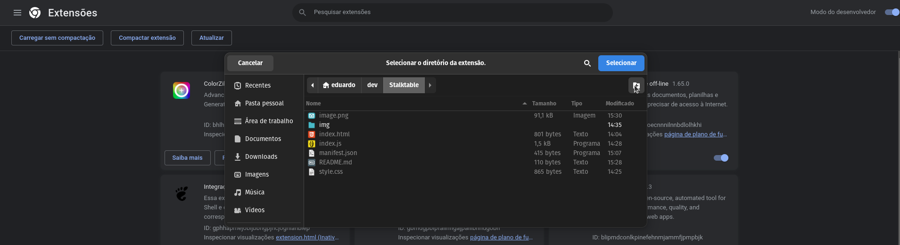

  
   
  <h1 align="center">Stalktable</h1>

Stalktable is a simple extension created to make it easier to spectate rooms on SpellTable.

How to install an extension in Chrome in developer mode:
1. Download the zip <a href="https://github.com/EduardoAguiarS/STALKTABLE/releases" target="_blank">here</a> and extract it to a folder.
2. Open Chrome and go to chrome://extensions
3. Activate developer mode in the upper right corner
4. Click on "Load unpacked" and select the project folder
5. That's it! The extension is already installed and ready to use.
 

***Português:***  
Stalktable é uma extensão simples criada para facilitar a visualização de salas no SpellTable.

Como instalar uma extensão no Chrome no modo desenvolvedor:
1. Faça o download do zip <a href="https://github.com/EduardoAguiarS/STALKTABLE/releases" target="_blank">aqui</a> e faça a extração em uma pasta.
2. Abra o Chrome e acesse chrome://extensions
3. Ative o modo desenvolvedor no canto superior direito
4. Clique em "Carregar sem compactação" e selecione a pasta do projeto
5. Pronto! A extensão já está instalada e pronta para uso.
